<picture>
  <source media="(prefers-color-scheme: dark)" srcset="assets/banner-oscuro.svg">
  <source media="(prefers-color-scheme: light)" srcset="assets/banner-claro.svg">
  
</picture>

  
  
  
  

### 👋 Sobre mí

- 🧠 Construyo **aplicaciones con IA, automatizaciones y webs** que funcionan **en producción 24/7**, no solo en demos.
- 🎨 Hago **webs con animación cinematográfica** y webs para **clientes reales**, como [Estética Carme Cots](https://esteticacarmecots.com).
- 🐧 Administro mi propio **VPS Linux** (Docker, systemd, backups, SSL) y uso **CachyOS + Hyprland** a diario.
- 🛠️ Ahora mismo: **[Irokai 色界](https://danitechia.github.io/irokai-web/)**, una personalización para Linux donde cada fondo de pantalla genera su propia estética.
- 🌍 Barcelona · Abierto a colaboraciones y proyectos.

### 🚀 Proyectos destacados

  
  
  
  
  
  
  
  

### 🛠️ Tecnologías

   
  
  

| Área | Lo que uso |
|---|---|
| **Backend** | Python · FastAPI · Django REST · Node.js · Java / Spring Boot · C# / .NET · Rust |
| **Frontend** | React · Vite · GSAP · JavaScript · HTML / CSS |
| **IA y automatización** | LLMs (Groq, Gemini, OpenAI) · Whisper · n8n · Prompt engineering · agentes de código |
| **Infraestructura** | Linux / VPS · Docker · systemd · MySQL · PostgreSQL · CI/CD (Vercel, GitHub Actions) |
| **Escritorio y Linux** | Tauri 2 · Hyprland · Lua · Bash · ffmpeg |

### 📈 Actividad

<picture>
  <source media="(prefers-color-scheme: dark)" srcset="https://raw.githubusercontent.com/danitechIA/danitechIA/output/serpiente-oscura.svg">
  <source media="(prefers-color-scheme: light)" srcset="https://raw.githubusercontent.com/danitechIA/danitechIA/output/serpiente.svg">
  
</picture>

### 📜 Certificaciones

| | Certificación | Emisor |
|---|---|---|
| 🎓 | **Meta Back-End Developer**, certificado profesional (9 cursos) | Meta · Coursera |
| 🤖 | **Google Prompting Essentials**, especialización (4 cursos) | Google · Coursera |

  Hecho con café, Linux y muchas horas · ¿Hablamos? <a href="mailto:ddctrabajocontacto@gmail.com">ddctrabajocontacto@gmail.com</a>

